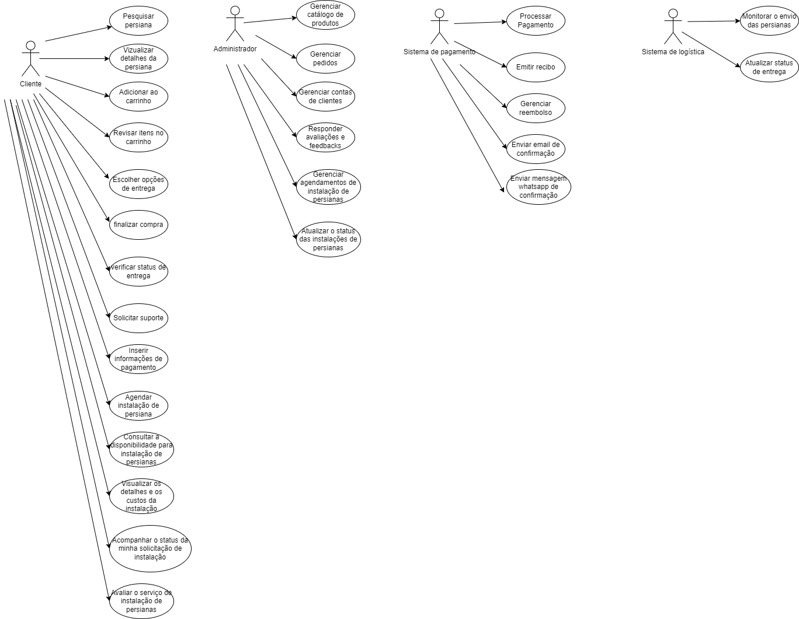

# Clash - E-commerce de Persianas

# Casos de Uso do Sistema

## Atores
- **Cliente**
- **Administrador**
- **Sistema de Pagamento**
- **Sistema de Logística**

# Histórias de Usuário do Sistema de E-commerce de Persianas

## Cliente
- **Pesquisar Persianas**
  - Eu, como cliente, desejo pesquisar persianas por critérios específicos para escolher qual quero comprar.
- **Visualizar Detalhes da Persiana**
  - Eu, como cliente, desejo visualizar detalhes sobre as persianas para obter mais informações antes de fazer uma compra.
- **Adicionar ao Carrinho**
  - Eu, como cliente, desejo adicionar persianas ao meu carrinho para revisá-las e comprar posteriormente.
- **Realizar Checkout**
  - Eu, como cliente, desejo realizar o checkout para finalizar minha compra e organizar a entrega.
- **Rastrear Meu Pedido**
  - Eu, como cliente, desejo rastrear meu pedido para saber o status da entrega.
- **Solicitar Suporte**
  - Eu, como cliente, desejo solicitar suporte para resolver dúvidas ou problemas com minhas compras.
- **Agendar Instalação de Persianas**
  - Eu, como Cliente, desejo agendar a instalação de persianas para garantir uma instalação profissional após a compra.
- **Consultar Disponibilidade para Instalação**
  - Eu, como Cliente, desejo consultar a disponibilidade para instalação de persianas para planejar minha compra e instalação.
- **Visualizar Detalhes e Custos da Instalação**
  - Eu, como Cliente, desejo visualizar os detalhes e os custos da instalação de persianas para tomar uma decisão informada.
- **Acompanhar Status da Instalação**
  - Eu, como Cliente, desejo acompanhar o status da minha solicitação de instalação de persianas para me manter informado sobre o progresso.
- **Avaliar Serviço de Instalação**
  - Eu, como Cliente, desejo avaliar o serviço de instalação de persianas para compartilhar minha experiência com a empresa e outros clientes.

## Administrador
- **Gerenciar Catálogo de Produtos**
  - Eu, como administrador, desejo gerenciar o catálogo de produtos para manter a loja atualizada e atrativa.
- **Gerenciar Pedidos**
  - Eu, como administrador, desejo gerenciar os pedidos para assegurar que sejam processados e entregues eficientemente.
- **Gerenciar Contas de Clientes**
  - Eu, como administrador, desejo gerenciar as contas dos clientes para oferecer melhor suporte e segurança.
- **Gerenciar Avaliações e Feedbacks**
  - Eu, como administrador, desejo gerenciar avaliações e feedbacks para manter uma boa reputação e melhorar os produtos.
- **Analisar Relatórios e Métricas**
  - Eu, como administrador, desejo analisar relatórios e métricas para entender o desempenho da loja e planejar melhorias.
- **Gerenciar Agendamentos de Instalação**
  - Eu, como Administrador / Equipe de Instalação, desejo gerenciar agendamentos de instalação de persianas para organizar eficientemente as operações de instalação.
- **Atualizar Status das Instalações**
  - Eu, como Administrador / Equipe de Instalação, desejo atualizar o status das instalações de persianas para manter os clientes informados.
- **Responder a Avaliações do Serviço de Instalação**
  - Eu, como Administrador / Equipe de Instalação, desejo responder a avaliações e feedbacks sobre o serviço de instalação para manter a qualidade do serviço e a satisfação do cliente.

## Sistema de Pagamento
- **Processar Pagamento**
  - Eu, como sistema de pagamento, desejo processar pagamentos de forma segura e eficiente para facilitar as transações.
- **Emitir Recibos**
  - Eu, como sistema de pagamento, desejo emitir recibos para confirmar as transações aos clientes.
- **Gerenciar Reembolsos**
  - Eu, como sistema de pagamento, desejo gerenciar reembolsos para resolver problemas de pagamento quando necessário.
- **Enviar Email de Confirmação**
  - Eu, como sistema de pagamento, desejo enviar um email de confirmação para informar o cliente sobre o sucesso do pagamento.
- **Enviar Mensagem WhatsApp de Confirmação**
  - Eu, como sistema de pagamento, desejo enviar uma mensagem WhatsApp de confirmação para informar o cliente sobre o sucesso do pagamento de forma rápida e conveniente.

## Sistema de Logística
- **Gerenciar Entregas**
  - Eu, como sistema de logística, desejo gerenciar as entregas para garantir que os produtos cheguem ao destino corretamente.
- **Atualizar Status de Entrega**
  - Eu, como sistema de logística, desejo atualizar o status de entrega para manter os clientes informados sobre o progresso da entrega.

# Diagrama de Caso de Uso

Link: https://drive.google.com/file/d/1fJOUxwT4j7GmnPCOhFQD1NL3UOPvYdWQ/view?usp=sharing

